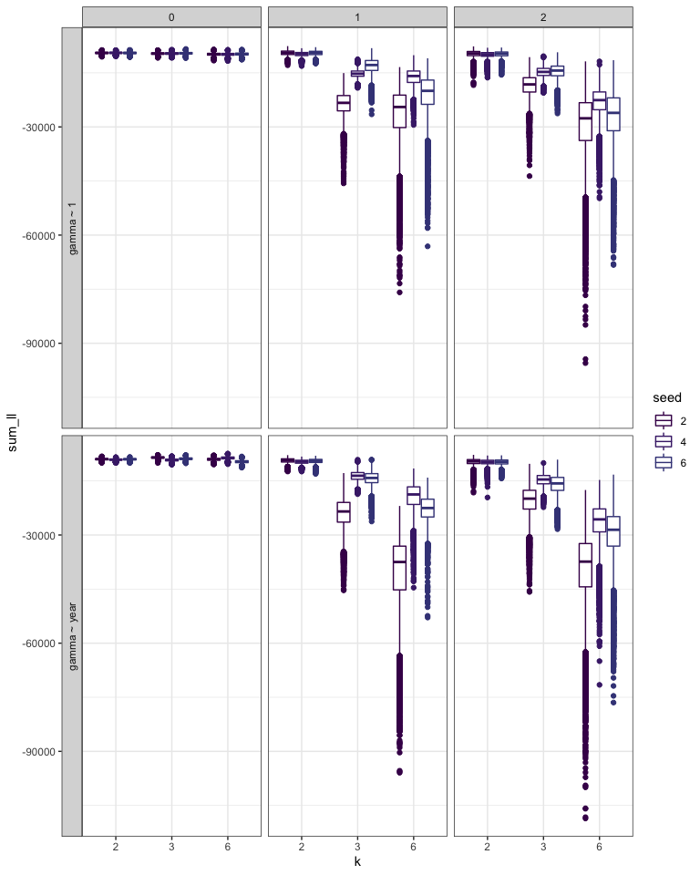

Composite LL
================

Calculating composite loglikelihood for all model specifications using leave-one-out cross validation.

Per model specification (number of changepoints, number of topics, LDA seed, covariates), fit one model to one dataset for every year of data. Every dataset has a focal year, plus a 2 year buffer on either side, witheld for model fitting. Then we calculate estimates of the likelihood of that focal year of data given the model, using estimates of the model parameters. We assemble a full timeseries likelihood by adding together loglikelihoods for every year, scrambling the (probably arbitrary) iterations that get combined. This gives us an estimated loglikelihood measuring performance of the model specification across all the years of data.

I tried using likelihood (not log), but the numbers were too small for R.

I had some internal debate over whether to keep LDA seeds fixed or try to incorporate variation between LDA models of the same k but different seed. I decided not to go there, because it seemed mathematically dubious and also like an organizational nightmare.

Model specifications
--------------------

-   3 seeds
-   0, 1, or 2 changepoints
-   2, 3, or 6 topics
-   ~1 or ~year
-   1000 iterations

Loglikelihood for all models
----------------------------

The y-axis is loglikelihood across all years. The x axis is the number of topics. The very short color scale is the seed (included to split the box plots). The facet columns are number of changepoints and the rows are formula (top is ~1, bottom is ~time). Variation represents variation in estimates of the likelihood from different parameter estimates (1000 draws).

There is a *lot* of variation in the likelihood estimates for the more complex models. 

Inter-seed variation is often of a similar scale to inter-model variation. 

### Mean loglikelihood

This is the same plot as above, but only plotting the mean loglikelihood across all estimates for each model specification.

Best models
-----------

This is the same plot as above, but filtered to the top 10 models based on *mean* loglikelihood. The 9 runners-up are semitransparent, and the top ranked one is shaded all the way in.

There's more inter-seed than inter-model variation, so don't interpret this result too strongly. But based on this extremely small run, the best model would be 3 topics, 0 changepoints, and ~time.

One fit of this model looks like this:

The other LDA timeseries look like this:

Predictions from "best" models
------------------------------

Here are observed-predicted time series plots for the best model. The green boxplots are predictions at each time step, and the purple lines are the observed abundances. (All relative). The facets are species. The variation in the boxplots is different draws.

Here are 1:1 observed-predicted plots for abundance for the 10 most abundant species, all draws, all timesteps.

The x-axis is predicted and the y axis is observed abundance. The black line is the 1:1 line.

The light blue dots are individual predictions. The black dots are mean predictions per species per timestep.

Loglikihood at each time step
-----------------------------

These are the individual likelihood estimates for each draw at each timestep. The x axis is the timestep and the y axis is the loglikelihood. Variation comes from different parameter estimates.

